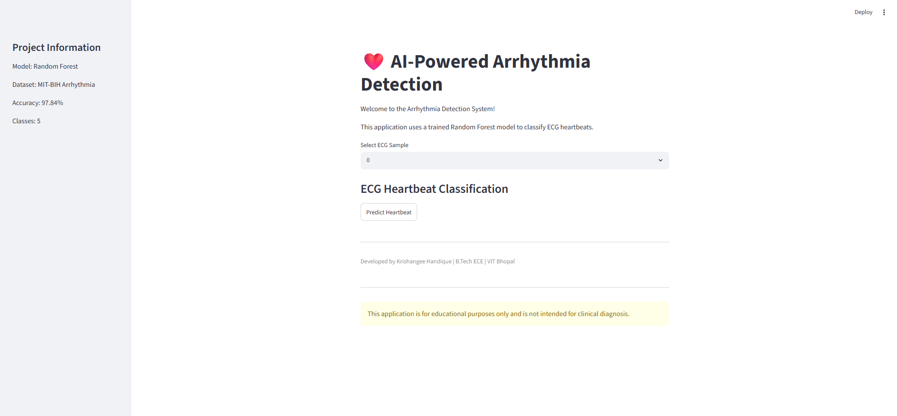
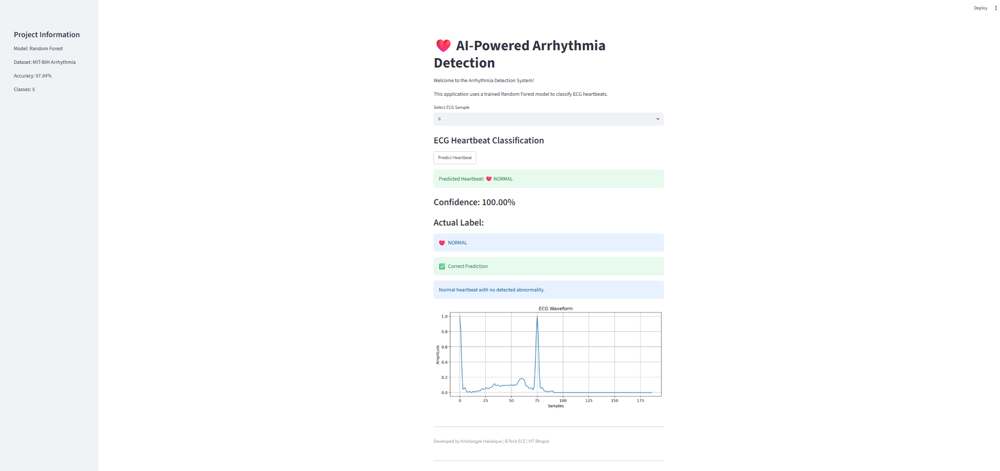
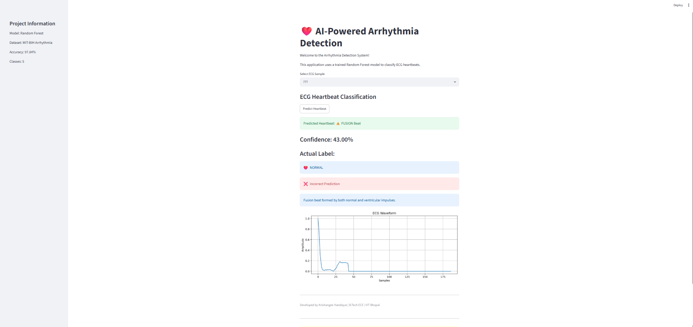
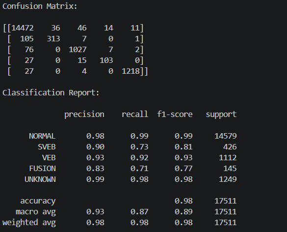

# ❤️ AI-Powered Arrhythmia Detection

An end-to-end machine learning project that classifies ECG heartbeats into five categories using the MIT-BIH Arrhythmia Dataset. The project includes ECG preprocessing, Random Forest classification, model evaluation, and an interactive Streamlit web application for heartbeat prediction and visualization.

---

##  Overview

Electrocardiogram (ECG) signals help detect abnormalities in heart rhythm. In this project, a Random Forest classifier is trained on the MIT-BIH Arrhythmia Dataset to classify ECG heartbeats into five classes.

The application allows users to:

- Select an ECG sample
- Predict the heartbeat category
- View the model confidence
- Compare the predicted label with the actual label
- Visualize the ECG waveform


## Project Highlights

- Trained a Random Forest classifier on the MIT-BIH Arrhythmia Dataset.
- Achieved **97.84% test accuracy** on heartbeat classification.
- Supports classification of **5 heartbeat categories**.
- Displays prediction confidence and compares predicted vs. actual labels.
- Provides ECG waveform visualization through an interactive Streamlit interface.

---

## Features

- End-to-end ECG heartbeat classification using Machine Learning
- ECG preprocessing and feature preparation
- Random Forest classifier for heartbeat prediction
- Model evaluation using Accuracy, Precision, Recall, F1-score, and Confusion Matrix
- Interactive Streamlit web application
- ECG waveform visualization
- Prediction confidence score
- Comparison between predicted and actual heartbeat class

---

## Project Workflow

```text
MIT-BIH Arrhythmia Dataset
            │
            ▼
     Data Preprocessing
            │
            ▼
    Feature Preparation
            │
            ▼
     Train-Test Split
            │
            ▼
 Random Forest Classifier
            │
            ▼
   Model Evaluation
            │
            ▼
 Streamlit Web Application
            │
            ▼
 ECG Heartbeat Prediction
```
---

## Dataset

This project uses the **MIT-BIH Arrhythmia Dataset**, one of the most widely used benchmark datasets for ECG heartbeat classification.

The dataset contains **187 ECG signal values** for each heartbeat along with a class label.

| Label | Heartbeat Type |
|------:|----------------|
| 0 | Normal Beat |
| 1 | Supraventricular Ectopic Beat (SVEB) |
| 2 | Ventricular Ectopic Beat (VEB) |
| 3 | Fusion Beat |
| 4 | Unknown Beat |
## Dataset

This project uses the **MIT-BIH Arrhythmia Dataset**, one of the most widely used benchmark datasets for ECG heartbeat classification.

The dataset contains **187 ECG signal values** for each heartbeat along with a class label.

| Label | Heartbeat Type |
|------:|----------------|
| 0 | Normal Beat |
| 1 | Supraventricular Ectopic Beat (SVEB) |
| 2 | Ventricular Ectopic Beat (VEB) |
| 3 | Fusion Beat |
| 4 | Unknown Beat |

### Dataset Download

The dataset is not included in this repository because it exceeds GitHub's file size limit.

Download the dataset from:

https://www.kaggle.com/datasets/shayanfazeli/heartbeat

After downloading, place the CSV files inside the `data/` folder.
---

# Model Performance

The Random Forest classifier achieved strong performance on the MIT-BIH test dataset.

| Metric | Value |
|--------|------:|
| Accuracy | **97.84%** |
| Classes | 5 |
| Model | Random Forest |

The model was evaluated using:

- Accuracy
- Precision
- Recall
- F1-score
- Confusion Matrix
- Classification Report

Although the overall accuracy is high, metrics such as recall are also important because they measure how well the model detects minority heartbeat classes like SVEB and Fusion beats.

---

# Project Structure

```text
ECG_Project/
│
├── data/
│   ├── mitbih_train.csv
│   └── mitbih_test.csv
│
├── plots/
├── screenshots/
├── docs/
│
├── src/
│   ├── app.py
│   ├── train_model.py
│   ├── predict.py
│   ├── preprocessing.py
│   ├── filter_signal.py
│   ├── r_peak_detection.py
│   ├── model_preparation.py
│   ├── data_analysis.py
│   ├── visualization.py
│   └── load_ecg.py
│
├── arrhythmia_model.pkl
├── requirements.txt
├── README.md
├── LICENSE
└── .gitignore
```
---

# Screenshots

## Home Page



---

## Normal Heartbeat Prediction



---

## Fusion Beat Prediction



---

## Unknown Beat Prediction


---

## Confusion Matrix


---

## Classification Report



---

# Installation

## 1. Clone the repository

```bash
git clone https://github.com/YOUR_USERNAME/AI-Powered-Arrhythmia-Detection.git
```

## 2. Navigate to the project folder

```bash
cd AI-Powered-Arrhythmia-Detection
```

## 3. Install the required libraries

```bash
pip install -r requirements.txt
```

## 4. Run the Streamlit application

```bash
cd src
streamlit run app.py
```
---

# Technologies Used

### Programming Language
- Python

### Machine Learning
- Scikit-learn
- Random Forest Classifier

### Data Processing
- Pandas
- NumPy

### Visualization
- Matplotlib

### Web Framework
- Streamlit

### Model Serialization
- Joblib

### Dataset
- MIT-BIH Arrhythmia Dataset

---

# Results

The Random Forest classifier achieved excellent performance on the MIT-BIH Arrhythmia dataset.

| Metric | Value |
|---------|------:|
| Accuracy | **97.84%** |
| Number of Classes | 5 |
| Model | Random Forest |

### Evaluation Metrics

- Accuracy: **97.84%**
- Precision: High across most heartbeat classes
- Recall: Strong overall performance, with lower recall for minority classes such as SVEB and Fusion beats
- F1-score: Balanced performance across classes

The model was evaluated using:
- Confusion Matrix
- Classification Report
- Prediction Confidence

---

# Limitations

- The dataset is imbalanced, with Normal beats significantly outnumbering abnormal beats.
- Minority classes such as SVEB and Fusion beats are more difficult to classify accurately.
- The application is designed for educational purposes and should not be used for clinical diagnosis.
---

# Future Improvements

- Train deep learning models such as 1D CNN and LSTM.
- Support user-uploaded ECG signals.
- Improve performance on minority heartbeat classes.
- Deploy the application on Streamlit Community Cloud.
- Evaluate the model on additional ECG datasets.
---

# Author

**Krishangee Handique**

B.Tech Electronics and Communication Engineering  
VIT Bhopal University

Email: "krisdig30@gmail"

GitHub: *()*
---

# License

This project is licensed under the MIT License.